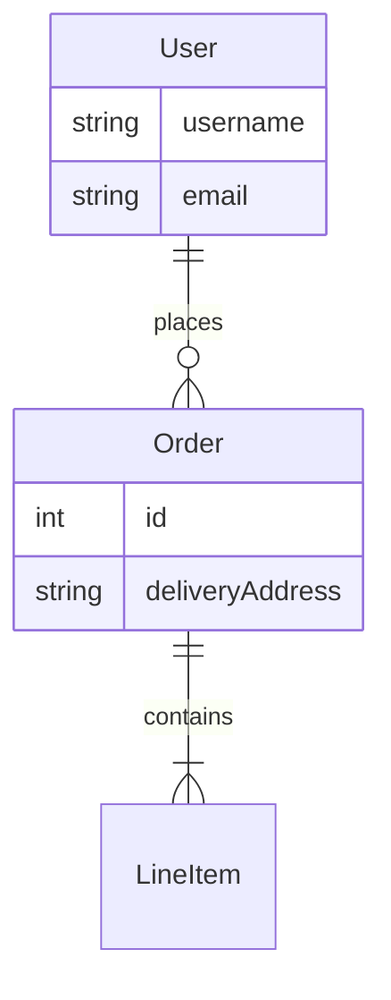

# Schema Design & ERD Guide

## 1. Normalization Audit

Review entities for data redundancy and anomalies.

- **1NF (Atomicity):** Ensure columns don't contain lists or complex structures (e.g., comma-separated values).
- **2NF (Partial Dependencies):** In composite keys, non-key attributes must depend on the *whole* key.
- **3NF (Transitive Dependencies):** Non-key attributes should not depend on other non-key attributes.
  - *Anti-pattern:* Storing `zip_code` and `city` in a `User` table.
  - *Fix:* Move `city`/`state` to a `ZipCode` lookup table.

## 2. Constraints & Integrity

- **Not Null:** Prefer `NOT NULL` columns over nullable ones to simplify application logic and avoid NullPointerExceptions.
- **Unique Constraints:** Enforce business uniqueness at the DB level, not just app level.
- **Check Constraints:** Use DB constraints for valid ranges (e.g., `price > 0`) where supported.

## 3. ERD Generation

When asked to "generate an ERD" or "document the schema", produce a **Mermaid** class diagram.

### Format

### Extraction Strategy
1.  Identify all `@Entity` (Java) or `Base` (Python) classes.
2.  Map `@OneToMany`, `@ManyToOne` (Java) or `relationship()` (Python) to lines.
3.  Include key fields (PKs) and significant columns.
